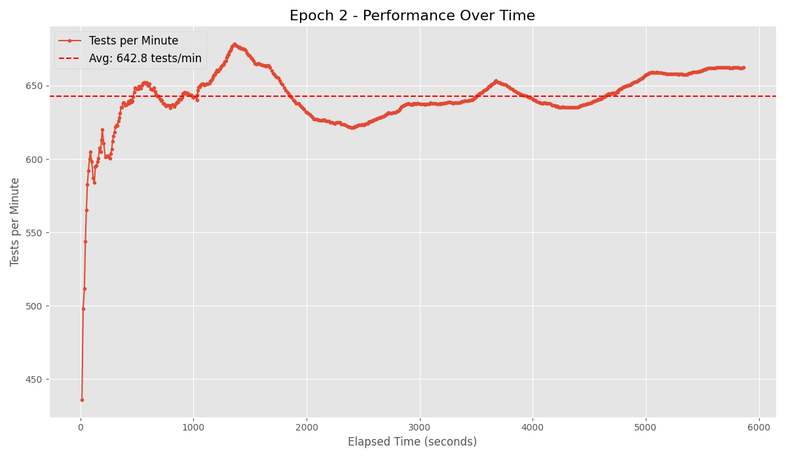
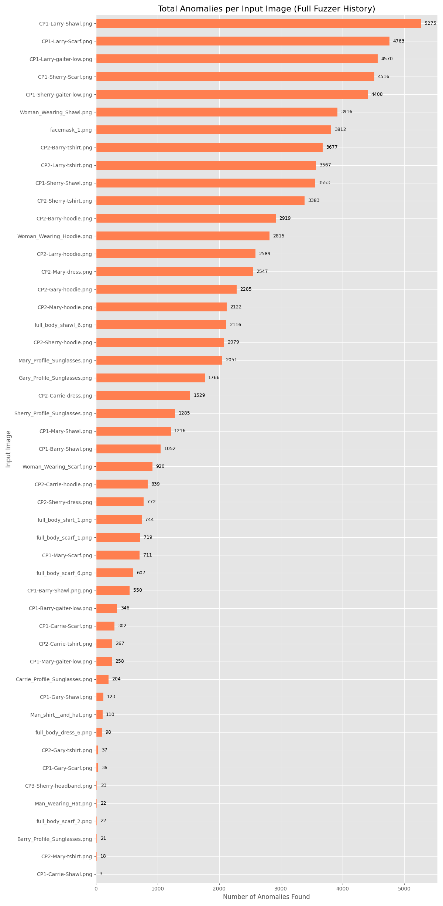
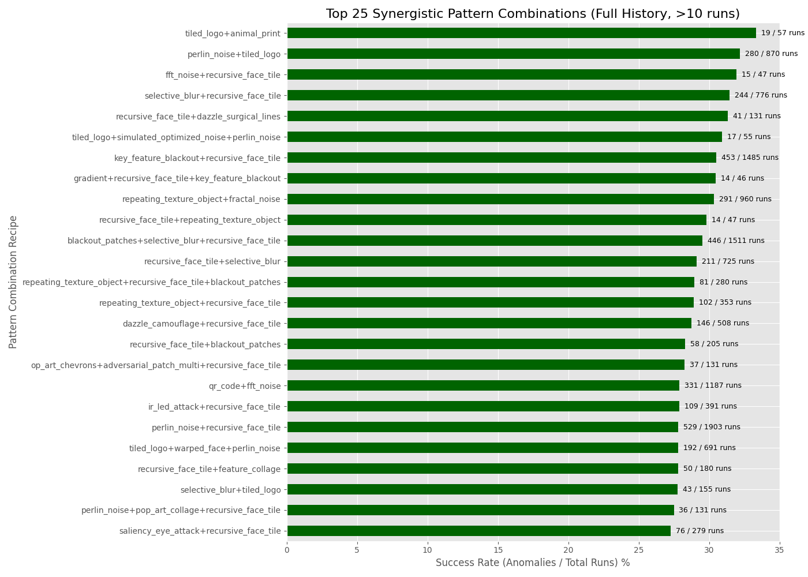

# nonRecognition — Adversarial Fuzzer

  

# Fabrics that FIGHT facial recognition

Join the first scientific effort to build reproducible, testable adversarial textiles and open source software that gives privacy back to people.
<!-- 

  

  <b><a href="https://www.kickstarter.com/projects/hevnsnt/1029985405">Back us on Kickstarter</a></b> 
  <i>Limited early rewards and prototype swatches available</i>

-->

## The Mission

I'm a hacker. I see technology differently. For years, I've been fascinated by how machines interpret our world and us: how algorithms decide who is seen, tracked, and recognized, often with unsettling consequences for personal privacy.

I believe we can engineer fabrics to confuse these systems. My goal is to build a **reproducible, science-driven process** to design and test these adversarial textiles. I test them rigorously against multiple models in real-world conditions to create a wardrobe that protects my privacy... and yours.

### Wait, Hasn't This Been Done Before?

Yes, and the early work was brilliant. Artistic "adversarial patterns" from projects like [capable.design](https://capable.design/), [adversarialfashion.com](https://adversarialfashion.com/), and Adam Harvey’s amazing work at [adam.harvey.studio](https://adam.harvey.studio/) were groundbreaking. They inspired me and proved something was possible.

But, like many pioneering prototypes, they were often fragile. Many focused on older "person detection" systems (like classic [**HAAR Cascade**](https://medium.com/analytics-vidhya/haar-cascades-explained-38210e57970d) models) and were often only effective under perfect studio conditions. Modern facial recognition has advanced far beyond those simpler algorithms.

This project stands on the shoulders of those giants. My work continues that evolution, bringing those early ideas into a new generation of textiles built for today’s much more advanced detection systems.

### I Believe We Can Do Better.

I’m [Bill Swearingen](https://about.me/billswearingen). Having spent decades in security (co-founder of SecKC, speaker at [**BlackHat**](https://blackhat.com) & [**DEF CON**](https://defcon.org)) uncovering how complex systems fail, I’m applying that mindset to this problem.

My project, **nonRecognition**, is a research-focused program to transform those intriguing concepts into **robust, repeatable, and verifiable solutions**. I am trying to answer one hard question: *Can physical fabrics truly defeat state-of-the-art facial recognition in real-world conditions?*

To do this, **nonRecogition** is focused on two critical components:

1.  **A Custom Fuzzer and Testing Suite:** A high-performance fuzzer to generate, test, and scientifically analyze an infinite number of designs against an ensemble of modern recognition systems.
2.  **Develop Adversarial Textiles:** Physically printed, sustainable materials optimized to confound the most advanced facial recognition models (not just rudimentary detectors) and tested in real-life conditions.

---
<h2 align="center">Fuzzer in Action</h2>
To illustrate this process, here's a glimpse into the fuzzer at work. The fuzzer automatically tests facial detection resilience by taking baseline images, generating and overlaying diverse adversarial patterns, then running them through multiple detection and recognition models to identify failures or anomalies. These results feed into evolutionary mutation routines for future epochs, refining how patterns evolve to reveal weaknesses in recognition systems. 

  

As of v0.4, the fuzzer features a full-screen Terminal User Interface (TUI) for real-time analysis. This TUI provides live-updating panels for overall stats, epoch progress, a detailed anomaly log, and an in-terminal image preview of the most recent anomaly found. You'll notice the *Anomaly Preview* is a low-resolution, "pixel-art" style image. This is an intentional feature. The image is rendered inside the terminal using text characters and is resized to a small character width for performance. *Another thing to Note: In this example you can see the mutation and evolution engines working (increased anomalies) over each epoch as the fuzzer "learns" what works!* ✨COOL✨ 

Each image below represents a unique adversarial pattern generated and then applied to a facial region, ready for testing against advanced recognition models. These are just a few of the hundreds of thousands the system evaluates per epoch to find those elusive "failure patterns." *(Note: This sample is only a fraction of our input models and while some show analysis anomalies; it does not include any bypass techniques.)*

<table align="center" style="border-collapse:collapse; border-spacing:0; padding:0; margin:0;">
  <tr>
    <td style="padding:0; margin:0;"></td>
    <td style="padding:0; margin:0;"></td>
    <td style="padding:0; margin:0;"></td>
  </tr>
  <tr>
    <td style="padding:0; margin:0;"></td>
    <td style="padding:0; margin:0;"></td>
    <td style="padding:0; margin:0;"></td>
  </tr>
  <tr>
    <td style="padding:0; margin:0;"></td>
    <td style="padding:0; margin:0;"></td>
    <td style="padding:0; margin:0;"></td>
  </tr>
</table>

---

## What Makes This Fuzzer Different?

This isn't just a random pattern generator. It's a purpose-built research tool designed to find *robust* vulnerabilities in *modern* AI models.

### ⚙️ Core Features ⚙️
* **Hardware-Agnostic HPC:** The fuzzer's pattern engine is a "write-once, run-anywhere" system. It auto-detects the best available compute backend at runtime and uses optimized code paths for:
    * **NVIDIA CUDA** (via cuPy)
    * **Apple Silicon Metal** (via mlx)
    * **JIT-Compiled CPU** (via numba)
    * **Standard CPU** (via numpy)
    * This allows for massive parallel throughput on any modern machine, from a MacBook Pro to a dedicated NVIDIA GPU server, with many pattern generators running natively on the GPU.

* **Targets an Ensemble of Modern Models:** This fuzzer doesn't just target one model. It validates every pattern against an *ensemble* of state-of-the-art systems simultaneously:
    * **InsightFace (`buffalo_l`):** A large, high-accuracy face detector.
    * **InsightFace (`buffalo_s`):** A smaller, faster face detector.
    * **YOLOv8n:** A modern, real-time object detector (used for person detection).
    * An anomaly is registered if it fools the models in a significant way (e.g., fooling *both* face models, or causing a *dramatic* drop in confidence).

* **Genetic Algorithm for "Evolved" Patterns:** The fuzzer learns. When it finds a pattern that causes a failure (an "anomaly"), it saves that pattern's "recipe" to a `PRIORITY_TESTS` list. In the next epoch, it uses these successful recipes as parents for a **genetic algorithm**:
    * **Mutation:** It randomly adds, removes, or swaps pattern layers.
    * **Crossover:** It splices two successful parent recipes together to create a new child.
    * This allows the fuzzer to "evolve" increasingly complex and effective patterns over time.

* **Landmark-Aware "Surgical" Attacks:** The pattern library goes far beyond simple noise. It includes "surgical" attacks that target specific parts of the AI's "brain" by first finding the baseline facial landmarks:
    * `adversarial_patch:` Places a small, high-contrast "sticker" on a key feature like the nose, cheek, or forehead.
    * `landmark_noise:` Applies noise/blur only to the detected eyes, nose, and mouth.
    * `dazzle_camouflage` / `hyperface_like:` Use landmark locations to draw disruptive lines through key features.
    * `swapped_landmarks:` Pastes the mouth over the eye, etc.
    * `saliency_eye_attack:` Stamps dozens of eyes to confuse the model's bounding-box and non-maximum suppression (NMS) logic.

* **Built for Scale and Research-Grade Reporting:**
    * **Massively Parallel:** Uses Python's `multiprocessing` (with a robust spawn context) to run tests across all available CPU cores, managing the per-worker GPU/model resources.
    * **Reproducible Outputs:** The fuzzer saves the exact recipe.json for every high-priority anomaly. A separate utility then uses this recipe to deterministically generate a 300-DPI, print-ready file for physical validation."
    * **Stateful:** Can be stopped (Ctrl+C) and resumed (--resume) at any time, preserving all learned priority tests.
    * **Advanced Reporting:** A dedicated plot_reports.py script analyzes the entire fuzzer history (.jsonl and .txt logs) to generate research-ready plots on:
    	* **Pattern Success Rate:** (*e.g., `fractal_noise` has a 5.2% anomaly rate over 10,000 runs*).
    	* **Pattern Synergy:** (*e.g., `dazzle+vortex` is 3x more effective than either alone*).
    	* **Anomaly Type Distribution:** (*e.g., `hyperface` causes `FACE_LOW_CONF`, while `adversarial_patch` causes `FACE_ENSEMBLE`*).
    	*  **Priority Queue Growth:** (*e.g., "Is the fuzzer still finding new vulnerabilities?"*).

---

## 🎨 The Adversarial Patterns 🎨

The fuzzer selects from a diverse library of pattern generators. This list is constantly expanding.

* **Geometric & Noise:**
    * `simple_shapes`
    * `fractal_noise`
    * `perlin_noise`
    * `hf_noise` (High-Freq Static)
    * `checkerboard`
    * `gradient`
    * `op_art_chevrons`
    * `tiled_logo`
    * `fft_noise`
* **Feature-Based & Saliency:**
    * `feature_collage` (stamps random facial features)
    * `saliency_eye_attack` (densely stamps *only* eyes)
    * `recursive_face_tile` (tiles the user's own face)
    * `ascii_face` (draws text-based faces)
    * `animal_print` (procedural leopard/jaguar spots)
    * `trypophobia` (clusters of small, high-contrast holes)
    * `pop_art_collage` (line-art based facial features)
* **Surgical & Landmark-Based:**
    * `landmark_noise` (applies noise/blur *only* to key points)
    * `swapped_landmarks` (pastes the mouth over the eye, etc.)
    * `adversarial_patch` (places a small "sticker" on a key feature)
* **Camouflage & Texture:**
    * `camouflage` (uses textures derived from nature)
    * `repeating_texture_object`
    * `warped_face` (uses a full face as a warped texture)
* **Structural & Dazzle:**
    * `hyperface_like` (high-contrast hyperface-like blocky pattern)
    * `dazzle_camouflage`(CV Dazzle-like pattern)
    * `interference_lines` (Moire-like patterns)
    * `3d_wireframe` (projects 3D cubes)
* **Glitch & Sensor Attacks:**
    * `vortex` (twisting distortion)
    * `optical_flow` (liquify-style warp)
    * `photonegative_patch`
    * `colorspace_jitter` (noise in Cr/Cb channels only)
    * `selective_blur`
    * `pixel_sort_glitch`
* **Other:**
    * `random_text`
    * `qr_code`
    * `ir_led_attack` (simulates IR glare/bloom)
    * `blackout_patches` (solid negative space)
---

## 🛠️ Project Statistics and Reports 🛠️

This repository currently contains research artifacts and documentation related to the Adversarial Fabric Fuzzer project. The core fuzzer code, model integrations, and data generation routines are not publicly released at this stage.

At this time, the fuzzer is used privately for controlled testing and scientific evaluation. This research is **SEVERELY resource-constrained**. The fuzzer is designed for massive parallelization, but is currently running on limited hardware, achieving a rate of ~535 tests per minute (as shown in the performance report below).

To truly explore the vast landscape of adversarial patterns and evolve robust solutions, significantly more computational power is required. A dedicated AI workstation like the **NVIDIA DGX Spark** (featuring 4x A100 80GB GPUs) could potentially run an estimated **~24,000 tests per minute** (*representing a ~45x increase in research velocity*). 
Running continuously for 3 months (approximated as 90 days) at the current rate, the fuzzer would complete approximately **69.3 million tests**. To complete that same number of tests, **a single DGX Spark would take only 2 days**. This acceleration is crucial for discovering, evolving, and validating effective patterns exponentially faster.
<!-- 
If you are interested in accelerating this research, please consider [supporting the project on Kickstarter](https://kickstarter.com).
-->
# Research Reporting

To scientifically track progress and validate results, the fuzzer includes a powerful reporting suite that analyzes the entire history of the fuzzer's test runs. This moves our findings beyond single anecdotes to identify statistically significant trends. While the reporting suite is fully functional, our current focus is on scaling fuzzer throughput. The statistical relevance of these reports will grow as we launch longer, multi-epoch research campaigns.

Here are recent reports generated:

**1. Fuzzer Performance Report**
This chart tracks the fuzzer's raw throughput. It's our "speedometer," showing how many tests we can run per minute.

**2. Target Image Vulnerability**
This report answers: "Which of our test images is the 'weakest' or most vulnerable target?" By tracking the total number of anomalies per image, we can identify which poses, lighting conditions, or facial structures are most easily confused by adversarial patterns.

**3. Pattern Success Rate (The "Leaderboard")**
This is the primary "leaderboard" for individual patterns. It calculates the raw success rate (Anomalies / Total Runs) for every pattern that has been run a significant number of times. This tells us which patterns are the most effective "building blocks."

**4. Synergistic Pattern Combinations**
This report is where the genetic algorithm's power becomes visible. It answers: "Are combinations of patterns more effective than single patterns?" It looks for "synergy," where two or more patterns layered together (e.g., `fft_noise+tiled_logo`) have a much higher success rate than they would individually.

**5. Top Specific Vulnerabilities**
This is the most granular report. It identifies the "golden" test cases: the exact pattern recipe on a specific image that failed most often. This shows us which vulnerabilities are highly repeatable and are the best candidates for physical printing and real-world testing.

**6. Anomaly Type Distribution**
This report analyzes how a pattern is "winning." Instead of just "it worked," it shows if a pattern is causing the AI to find extra people (EXTRA_PERSONS_DETECTED) or lose the person entirely (PERSON_LOST). This helps us understand what part of the AI's logic is being exploited.

# 📜 Ethics and Intent
My goal is simple: to build a wardrobe that protects my privacy — and yours. This project is a research tool for auditing computer vision systems. The goal is to discover and document vulnerabilities in detection models to help developers build more robust, fair, and secure systems. The adversarial patterns are a byproduct of this research, offered to the public to promote awareness and discussion about privacy in an age of ubiquitous surveillance.

# 🗺️ Roadmap: v0.5 Proposals
**Facial Recognition Matching Pipeline**
  * **TODO:** Implement a 1:N matching pipeline (e.g., using ArcFace) to test if a pattern causes a misidentification (matching the wrong person) in addition to a detection failure.

**Feature Enhancements**
  * improve detection if state exists but user does not pass --resume
  * Refactor Fuzz class
  * Improve Log parsing to be less fragile
  * Improve resolution of Anomaly Preview (yes I know it looks like Minecraft, I am resource constrained ok)
**Expanded Evaluation Harness**
* TODO: Add support for other common open-source detectors (e.g., MTCNN, RetinaFace from face_detection lib) to test the generality of found patterns.
* TODO: Build a harness for testing against closed-source cloud APIs (e.g., Azure, AWS Rekognition) to audit commercial systems.
