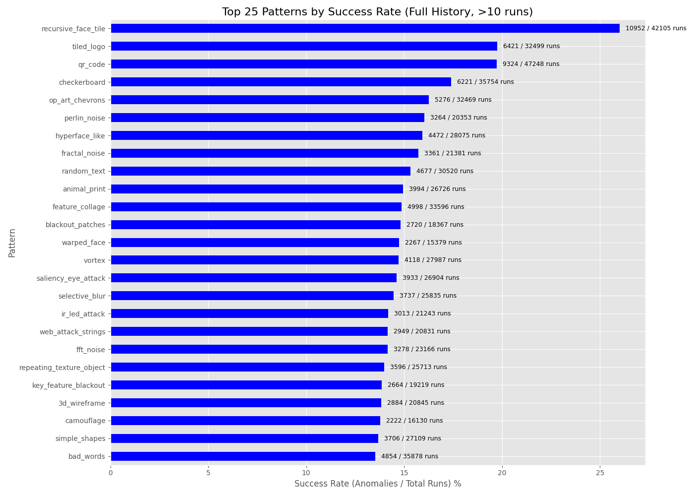
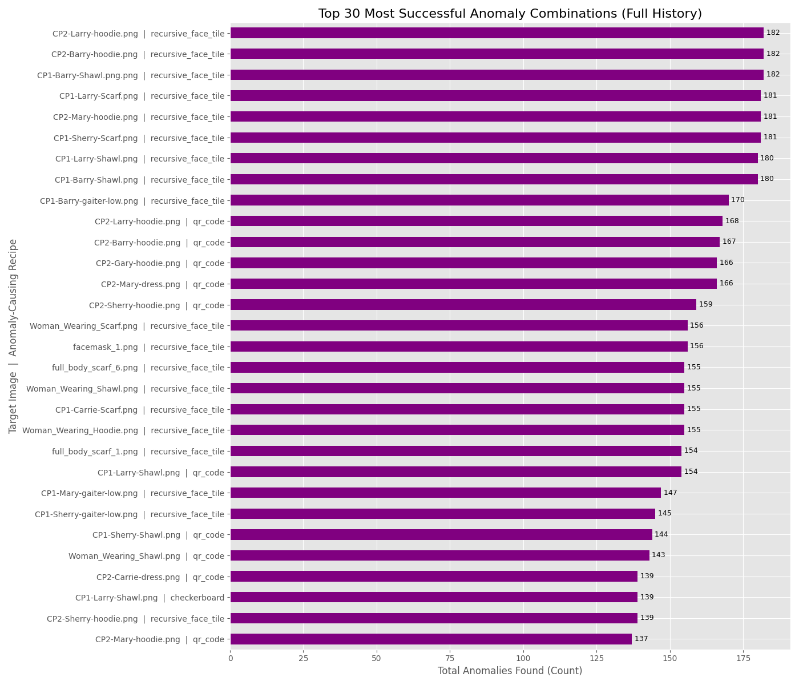

  

Could the pattern on your scarf make you invisible to an AI camera? Could a headband block facial recognition? This project is the scientific search to find out. I built a fuzzer that generates and tests millions of adversarial patterns, designs that confuse AI surveillance and give privacy back to people.

Privacy isn’t a luxury; it is a fundamental right. Around the world, people are being targeted because a camera decided they looked suspicious. Our goal is to push back, creating wearable patterns that, when printed on fabric, can disrupt or prevent facial recognition entirely.

Whether you’re an everyday person who just wants to walk down the street unseen, a DEF CON hacker who knows the stakes of constant surveillance, or someone whose freedom literally depends on staying off a government watch list, this project is for you. 

# Fabrics that FIGHT facial recognition

> **Join the first scientific effort to build reproducible, testable adversarial textiles that gives privacy back to people.**
>
> ⚠️⚠️⚠️ This project's progress is **severely limited by computational resources**. **[Please see how you can help.](#call-for-help)**

<!-- 

  

  <b><a href="https://www.kickstarter.com/projects/hevnsnt/1029985405">Back us on Kickstarter</a></b> 
  <i>Limited early rewards and prototype swatches available</i>

-->

## Quick Links

- [The Mission](#the-mission)
- [Fuzzer in Action](#fuzzer-in-action)
- [Latest Discoveries](#-latest-discoveries-from-the-distributed-network)
- [What Makes This Fuzzer Different?](#what-makes-this-fuzzer-different)
- [Distributed Testing Network](#distributed-testing-network-beta)
- [Live Results Dashboard](#live-results-dashboard)
- [The Adversarial Patterns](#the-adversarial-patterns)
- [Call for help](#call-for-help)
- [Research Reporting](#research-reporting)
- [Ethics and Intent](#ethics-and-intent)
- [Future Roadmap](#roadmap-proposals)

## The Mission

I'm a hacker. I see technology differently. For years, I've been fascinated by how machines interpret our world and us: how algorithms decide who is seen, tracked, and recognized, often with unsettling consequences for personal privacy.

I believe fabrics can be engineered to confuse modern vision systems. The plan is simple: build a reproducible, science-first pipeline that designs, tests, and refines adversarial textiles. Every generated pattern is validated against multiple detection models and then tested in real-world conditions. Results so far are positive.

### Wait, Hasn't This Been Done Before?

Yes, and the early work was brilliant. Artistic "adversarial patterns" from projects like [capable.design](https://capable.design/), [adversarialfashion.com](https://adversarialfashion.com/), and Adam Harvey’s amazing work at [adam.harvey.studio](https://adam.harvey.studio/) were groundbreaking. They proved something like this was possible and inspired me to improve on their research.

But, like many pioneering prototypes, they were often fragile. Many focused on older "person detection" systems (like classic [**HAAR Cascade**](https://medium.com/analytics-vidhya/haar-cascades-explained-38210e57970d) models) and were often only effective under perfect studio conditions. Modern facial recognition has advanced far beyond those simpler algorithms.

This project stands on the shoulders of those giants. My work continues that evolution, bringing those early ideas into a new generation of textiles built for today’s much more advanced detection systems.

### I Believe We Can Do Better.

I’m [Bill Swearingen](https://about.me/billswearingen). Having spent decades in cybersecurity and hacking fields (co-founder of [**SecKC**](https://seckc.org), speaker at [**BlackHat**](https://blackhat.com) & [**DEF CON**](https://defcon.org)) understanding and uncovering how complex systems fail, I’m applying that mindset to this problem. While I am associated with SecKC, this project, code, and research are not in any way associated with SecKC.

My project, **noRecognition**, is a research-focused program to transform those intriguing concepts into **robust, repeatable, and verifiable solutions**. I am trying to answer one hard question: *Can physical fabrics truly defeat state-of-the-art facial recognition in real-world conditions?*

To do this, **noRecogition** is focused on two critical components:

1.  **A Custom Fuzzer and Testing Suite:** A high-performance, self-learning fuzzer that gets smarter as it runs, generating, testing, and scientifically analyzing an infinite range of designs against an ensemble of modern recognition systems.
2.  **Develop Adversarial Textiles:** Physically printed, sustainable materials optimized to confound the most advanced facial recognition models (not just rudimentary detectors) and tested in real-life conditions.

---
## Fuzzer in Action
To illustrate this process, here's a glimpse into the fuzzer at work. The fuzzer automatically tests facial detection resilience by taking baseline images, generating and overlaying diverse adversarial patterns, then tests them through multiple detection and recognition models to identify failures or anomalies. These results feed into evolutionary mutation routines for future epochs, refining how patterns evolve to reveal weaknesses in recognition systems.

  

The fuzzer features a full-screen Terminal User Interface (TUI) for real-time analysis. This TUI provides live-updating panels for overall stats, epoch progress, a detailed anomaly log, and an in-terminal image preview of the most recent anomaly found. You'll notice the *Anomaly Preview* is a low-resolution, "pixel-art" style image. This is an intentional feature. The image is rendered inside the terminal using text characters and is resized to a small character width for performance. *Another thing to Note: In this example you can see the mutation and evolution engines working (increased anomalies) over each epoch as the fuzzer "learns" what works!* ✨COOL✨

As of **v0.9.8**, the fuzzer now runs as a **distributed testing network** with multiple machines contributing compute power simultaneously. All results are aggregated in real-time and displayed on a live dashboard at [**norecognition.org**](https://norecognition.org), where you can watch the research progress unfold.

>(Note: This sample is only a fraction of our input models and while some show analysis anomalies, it purposefully does not include any bypass techniques. Version v0.9.8 standardizes all testing on a fixed, diverse set of persona images, which are described in detail in [`personas.md`](./personas.md)).

Each image below represents a unique adversarial pattern generated and then applied to a facial region, ready for testing against advanced recognition models. These are just a few of the thousands the system evaluates per epoch to find those elusive "failure patterns." 

---

## 🔥 Latest Discoveries from the Distributed Network

These are the **9 most recent anomaly patterns** discovered by the distributed testing network. These patterns successfully confused the AI models and are automatically updated every 6 hours as new discoveries are made. See all discoveries live at [**norecognition.org**](https://norecognition.org).

<!-- RECENT_ANOMALIES_START -->
<table align="center" style="border-collapse:collapse; border-spacing:0; padding:0; margin:0;">
  <tr>
    <td style="padding:0; margin:0;"></td>
    <td style="padding:0; margin:0;"></td>
    <td style="padding:0; margin:0;"></td>
  </tr>
  <tr>
    <td style="padding:0; margin:0;"></td>
    <td style="padding:0; margin:0;"></td>
    <td style="padding:0; margin:0;"></td>
  </tr>
  <tr>
    <td style="padding:0; margin:0;"></td>
    <td style="padding:0; margin:0;"></td>
    <td style="padding:0; margin:0;"></td>
  </tr>
</table>
<!-- RECENT_ANOMALIES_END -->

---

## What Makes This Fuzzer Different?

This isn't just a random pattern generator. It's a purpose-built research tool designed to find *robust* vulnerabilities in *modern* AI models.

### ⚙️ Core Features ⚙️
* **Distributed Testing Network (v0.9.8):** The fuzzer now operates as a coordinated network where multiple machines around the world contribute compute power simultaneously. Results from all contributors are aggregated in real-time, dramatically accelerating research progress. See the live dashboard at [**norecognition.org**](https://norecognition.org) to watch the network in action.

* **Hardware-Agnostic HPC:** The fuzzer's pattern engine is a "write-once, run-anywhere" system. It has been tested on Apple Silicon and Windows 11 with NVidia CUDA GPUs. It auto-detects the best available compute backend at runtime and uses optimized code paths for:
    * **NVIDIA CUDA** (via cuPy)
    * **Apple Silicon Metal** (via mlx)
    * **JIT-Compiled CPU** (via numba)
    * **Standard CPU** (via numpy)
    > This allows for massive parallel throughput on any modern machine, from a MacBook Pro to a dedicated NVIDIA GPU server, with many pattern generators running natively on the GPU.

* **Targets an Ensemble of Modern Models:** This fuzzer doesn't just target one model. It validates every pattern against an *ensemble* of state-of-the-art systems simultaneously:
    * **InsightFace (`buffalo_l`):** A large, high-accuracy face detector.
    * **InsightFace (`buffalo_s`):** A smaller, faster face detector.
    * **YOLOv8n:** A modern, real-time object detector (used for person detection).
    > An anomaly is registered if it fools the models in a significant way (e.g., fooling *both* face models, or causing a *dramatic* drop in confidence).

* **Genetic Algorithm for "Evolved" Patterns:** The fuzzer learns. When it finds a pattern that causes a failure (an "anomaly"), it saves that pattern's "recipe" to a `PRIORITY_TESTS` list. In the next epoch, it uses these successful recipes as parents for a **genetic algorithm**:
    * **Mutation:** It randomly adds, removes, or swaps pattern layers.
    * **Crossover:** It splices two successful parent recipes together to create a new child.
    > This allows the fuzzer to "evolve" increasingly complex and effective patterns over time.

* **Landmark-Aware "Surgical" Attacks:** The pattern library (now **61 unique patterns** as of v0.9.8) goes far beyond simple noise. It includes "surgical" attacks that target specific parts of the AI's "brain" by first finding the baseline facial landmarks:
    * `adversarial_patch:` Places a small, high-contrast "sticker" on a key feature like the nose, cheek, or forehead.
    * `landmark_noise:` Applies noise/blur only to the detected eyes, nose, and mouth.
    * `dazzle_camouflage` / `hyperface_like:` Use landmark locations to draw disruptive lines through key features.
    * `swapped_landmarks:` Pastes the mouth over the eye, etc.
    * `saliency_eye_attack:` Stamps dozens of eyes to confuse the model's bounding-box and non-maximum suppression (NMS) logic.
    > For a full list of all 61 patterns, please see [`pattern_generators.md`](./pattern_generators.md)

* **Built for Scale and Research-Grade Reporting:**
    * **Massively Parallel:** Uses Python's `multiprocessing` (with a robust spawn context) to run tests across all available CPU cores, managing the per-worker GPU/model resources.
    * **Reproducible Outputs:** The fuzzer saves the exact recipe.json for every high-priority anomaly. A separate utility then uses this recipe to deterministically generate a 300-DPI, print-ready file for physical validation.
    * **Stateful:** Can be stopped (Ctrl+C) and resumed (--resume) at any time, preserving all learned priority tests.
    * **Advanced Reporting:** A dedicated plot_reports.py script analyzes the entire fuzzer history (.jsonl and .txt logs) to generate research-ready plots on:
    	* **Pattern Success Rate:** (*e.g., `fractal_noise` has a 5.2% anomaly rate over 10,000 runs*).
    	* **Pattern Synergy:** (*e.g., `dazzle+vortex` is 3x more effective than either alone*).
    	* **Anomaly Type Distribution:** (*e.g., `hyperface` causes `FACE_LOW_CONF`, while `adversarial_patch` causes `FACE_ENSEMBLE`*).
    	*  **Priority Queue Growth:** (*e.g., "Is the fuzzer still finding new vulnerabilities?"*).

---

## Distributed Testing Network (Beta)

As of **v0.9.8**, the **noRecognition** project has evolved beyond a single-machine research tool. The fuzzer now operates as a **distributed testing network**, where multiple machines around the world can contribute compute power simultaneously to accelerate the search for effective adversarial patterns.

### How It Works

The distributed network coordinates testing across many machines:
* **Work Distribution:** The system generates batches of test cases and distributes them to available workers based on their computing capabilities
* **Parallel Processing:** Each worker processes patterns locally using their own hardware (GPU, CPU, etc.)
* **Result Aggregation:** All discoveries are submitted back to the central system and aggregated in real-time
* **Live Tracking:** Progress, pattern success rates, and anomaly discoveries are displayed on the live dashboard

### Join the Beta Testing

The distributed client is currently in **private beta testing** with a select group of contributors. If you have compute resources you'd like to contribute to this research and would like to participate in beta testing, **please contact me at [bill@seckc.org](mailto:bill@seckc.org)**.

I'm particularly interested in hearing from:
* Researchers with access to GPU clusters or high-performance workstations
* Organizations interested in privacy research
* Individuals passionate about fighting surveillance technology

---

## Live Results Dashboard

All testing progress is now visible in real-time at **[norecognition.org](https://norecognition.org)**.

### What You Can See:

* **Real-Time Statistics:** Watch as tests complete and anomalies are discovered across the distributed network
* **Pattern Leaderboard:** See which adversarial patterns are most effective at fooling facial recognition systems
* **Anomaly Gallery:** View the latest discoveries - patterns that successfully confused the AI models
* **Contributor Stats:** Track contributions from the distributed testing network

The dashboard updates live as workers around the world submit their test results, giving you a window into the ongoing research process. Visit [**norecognition.org**](https://norecognition.org) to see the current state of the research.

---

<h2 id="call-for-help">⚠️ Call for help ⚠️</h2>

This project's progress is **severely limited by computational resources**. Our primary goal is to discover the most effective adversarial patterns, which I estimate will require testing at least **5 Billion** *evolved* patterns. While the new **distributed testing network (v0.9.8)** has significantly accelerated our progress, we still need more computing power to reach our research goals in a reasonable timeframe.

### Progress Update: Distributed Network Helping! 📈

* **Previous Status (single machine):** ~534 tests/minute → 17.8 years to target
* **Current Status (v0.9.8 distributed beta):** Growing network of contributors → Progress accelerating
* **Test Target:** 5 Billion tests
* **What We Still Need:** More distributed workers and/or dedicated GPU clusters

The distributed network is proving the concept works, but we need to scale it further to achieve breakthrough results.

### Desired Status: Full Throttle 🚀🚀🚀

* **Required Hardware:** Research workstation (2x NVIDIA DGX Spark node cluster **or** Workstation with 4x NVIDIA GeForce RTX 5070 Ti GPUs)
* **Goal Test Rate:** ~**100,000 tests/minute** (~140x increase over original)
* **Time to Target:** **~2 Months** 🎉YAY🎉

### What we need

We need approximately **$20,000** to push this research forward. This funding will be strategically allocated to:
* Acquire essential hardware (e.g., two NVIDIA DGX Spark nodes).
* Generate high-quality, real-world images through professional photography.
* Begin our first production run of testing fabrics.

Want to read more about our justification and decision matrix for testing hardware? [Hardware Recommendation for Fuzzer Performance Scaling.md](./Hardware%20Recommendation%20for%20Fuzzer%20Performance%20Scaling.md)

### Can You Help Us Bridge the Gap? 🤝

There are several ways to contribute:

1. **Join the Distributed Beta:** Have compute resources? Contact me to become a beta tester
2. **Hardware Sponsorship:** Provide access to GPU clusters or high-performance workstations
3. **Cloud Credits:** Sponsor compute time on cloud platforms
4. **Financial Support:** Help fund dedicated hardware for the research

**Please reach out by emailing [bill@seckc.org](mailto:bill@seckc.org).**

<h2 id="research-reporting">Research Reporting</h2>

This repository currently contains research artifacts and documentation related to the Adversarial Fabric Fuzzer project. The core fuzzer code, model integrations, and data generation routines are not publicly released at this stage. At this time, the fuzzer is used privately for controlled testing and scientific evaluation.

As of **v0.9.8**, the project now operates as a **distributed testing network** with multiple contributors running workers simultaneously. All results are aggregated in real-time and displayed on the live dashboard at [**norecognition.org**](https://norecognition.org). This distributed architecture has significantly accelerated research progress compared to the original single-machine approach.

The fuzzer includes a powerful reporting suite that analyzes the entire history of test runs across all distributed workers. This moves our findings beyond single anecdotes to identify statistically significant trends. The statistical relevance of these reports continues to grow as more tests are completed across the distributed network.

**1. Fuzzer Performance Trend**: This chart is our "speedometer" and answers: "Is the fuzzer getting faster or slower with each epoch?"

### 📈 Pattern Effectiveness Analysis
**2. Pattern Success Rate (The "Leaderboard")**: This is the primary "leaderboard" for individual patterns. It answers: "What is the % success rate of 'fractal_noise' over all runs?"

**3. Synergistic Pattern Combinations**: This report shows the power of the genetic algorithm, answering: "Are combined patterns (e.g., 'fractal+dazzle') more effective?"

**4. Pattern Anomaly Type Distribution**: This report analyzes *how* a pattern is "winning." It answers: "What type of anomaly does 'fractal_noise' tend to cause?"

**5. Recipe Latency Report**: This report identifies computational bottlenecks by answering: "Which recipes are the most computationally expensive?"

**6. Mask-to-Face Overlap (IoU) vs. Success**: This report analyzes the physical placement of patterns, answering: "Does success depend on *how much* of the face is covered?"

### 🎯 Target Vulnerability Analysis
**7. Target Image Vulnerability**: This report answers: "Which of my input images is the 'weakest' or most vulnerable target?" This helps identify which poses, lighting, or facial structures are most easily confused.

**8. Top Specific Vulnerabilities**: This is the most granular report. It identifies the "golden" test cases by answering: "What is the most successful pattern against a specific image?"

**9. Image Anomaly Type Distribution**: This is the companion to the pattern report. It answers: "How do different images tend to fail?" (e.g., are some images prone to *extra* faces, while others cause *lost* faces?)

### 🤖 Fuzzer Performance & Strategy
**10. Priority Queue Growth**: This chart tracks the fuzzer's learning progress. It answers: "Is the fuzzer's discovery of *new* vulnerabilities slowing down?"

**11. Deduplication Effect**: This new report shows the gap between *total* anomalies found and *unique* ones added to the queue. It answers: "How effective is the fuzzer's deduplication?"

**12. Fuzzer Strategy Effectiveness**: This report validates our genetic algorithm. It answers: "Is our genetic algorithm better than random guessing?" (e.g., are 'evolved' tests more successful than 'random' ones?)

<h2 id="ethics-and-intent">📜 Ethics and Intent</h2>
My goal is simple: to build a wardrobe that protects my privacy — and yours. This project is a research tool for auditing computer vision systems. The goal is to discover and document vulnerabilities in detection models to help developers build more robust, fair, and secure systems. The adversarial patterns are a byproduct of this research, offered to the public to promote awareness and discussion about privacy in an age of ubiquitous surveillance.

<h2 id="roadmap-proposals">🗺️ Roadmap Proposals</h2>

A detailed, evolving roadmap (subject to change) is tracked in [`roadmap.md`](./roadmap.md)
