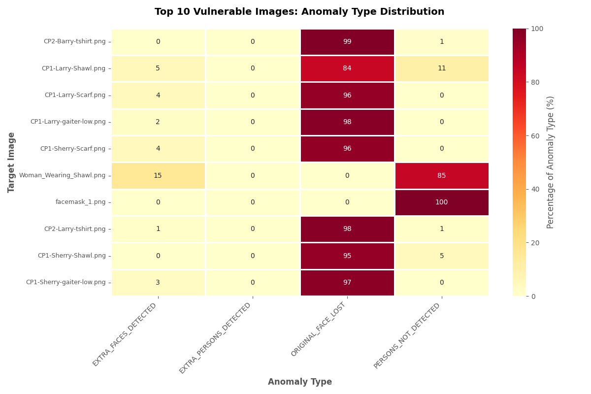

  

Could the pattern on your scarf make you invisible to an AI camera? Could a headband block facial recognition? This project is the scientific search to find out. I built a fuzzer that generates and tests millions of adversarial patterns, designs that confuse AI surveillance and give privacy back to people.

Privacy isn’t a luxury; it is a fundamental right. Around the world, people are being targeted because a camera decided they looked suspicious. Our goal is to push back, creating wearable patterns that, when printed on fabric, can disrupt or prevent facial recognition entirely.

Whether you’re an everyday person who just wants to walk down the street unseen, a DEF CON hacker who knows the stakes of constant surveillance, or someone whose freedom literally depends on staying off a government watch list, this project is for you. 

# Fabrics that FIGHT facial recognition

> **Join the first scientific effort to build reproducible, testable adversarial textiles that gives privacy back to people.**
>
> ⚠️⚠️⚠️ This project's progress is **severely limited by computational resources**. **[Please see how you can help.](#call-for-help)**

<!-- 

  

  <b><a href="https://www.kickstarter.com/projects/hevnsnt/1029985405">Back us on Kickstarter</a></b> 
  <i>Limited early rewards and prototype swatches available</i>

-->

## Quick Links

- [The Mission](#the-mission)
- [Fuzzer in Action](#fuzzer-in-action)
- [What Makes This Fuzzer Different?](#what-makes-this-fuzzer-different)
- [The Adversarial Patterns](#the-adversarial-patterns)
- [Call for help](#call-for-help)
- [Research Reporting](#research-reporting)
- [Ethics and Intent](#ethics-and-intent)
- [Future Roadmap](#roadmap-proposals)

## The Mission

I'm a hacker. I see technology differently. For years, I've been fascinated by how machines interpret our world and us: how algorithms decide who is seen, tracked, and recognized, often with unsettling consequences for personal privacy.

I believe fabrics can be engineered to confuse modern vision systems. The plan is simple: build a reproducible, science-first pipeline that designs, tests, and refines adversarial textiles. Every generated pattern is validated against multiple detection models and then tested in real-world conditions. Results so far are positive.

### Wait, Hasn't This Been Done Before?

Yes, and the early work was brilliant. Artistic "adversarial patterns" from projects like [capable.design](https://capable.design/), [adversarialfashion.com](https://adversarialfashion.com/), and Adam Harvey’s amazing work at [adam.harvey.studio](https://adam.harvey.studio/) were groundbreaking. They proved something like this was possible and inspired me to improve on their research.

But, like many pioneering prototypes, they were often fragile. Many focused on older "person detection" systems (like classic [**HAAR Cascade**](https://medium.com/analytics-vidhya/haar-cascades-explained-38210e57970d) models) and were often only effective under perfect studio conditions. Modern facial recognition has advanced far beyond those simpler algorithms.

This project stands on the shoulders of those giants. My work continues that evolution, bringing those early ideas into a new generation of textiles built for today’s much more advanced detection systems.

### I Believe We Can Do Better.

I’m [Bill Swearingen](https://about.me/billswearingen). Having spent decades in cybersecurity and hacking fields (co-founder of [**SecKC**](https://seckc.org), speaker at [**BlackHat**](https://blackhat.com) & [**DEF CON**](https://defcon.org)) understanding and uncovering how complex systems fail, I’m applying that mindset to this problem.

My project, **nonRecognition**, is a research-focused program to transform those intriguing concepts into **robust, repeatable, and verifiable solutions**. I am trying to answer one hard question: *Can physical fabrics truly defeat state-of-the-art facial recognition in real-world conditions?*

To do this, **nonRecogition** is focused on two critical components:

1.  **A Custom Fuzzer and Testing Suite:** A high-performance, self-learning fuzzer that gets smarter as it runs, generating, testing, and scientifically analyzing an infinite range of designs against an ensemble of modern recognition systems.
2.  **Develop Adversarial Textiles:** Physically printed, sustainable materials optimized to confound the most advanced facial recognition models (not just rudimentary detectors) and tested in real-life conditions.

---
## Fuzzer in Action
To illustrate this process, here's a glimpse into the fuzzer at work. The fuzzer automatically tests facial detection resilience by taking baseline images, generating and overlaying diverse adversarial patterns, then running them through multiple detection and recognition models to identify failures or anomalies. These results feed into evolutionary mutation routines for future epochs, refining how patterns evolve to reveal weaknesses in recognition systems. 

  

The fuzzer features a full-screen Terminal User Interface (TUI) for real-time analysis. This TUI provides live-updating panels for overall stats, epoch progress, a detailed anomaly log, and an in-terminal image preview of the most recent anomaly found. You'll notice the *Anomaly Preview* is a low-resolution, "pixel-art" style image. This is an intentional feature. The image is rendered inside the terminal using text characters and is resized to a small character width for performance. *Another thing to Note: In this example you can see the mutation and evolution engines working (increased anomalies) over each epoch as the fuzzer "learns" what works!* ✨COOL✨ 

>(Note: This sample is only a fraction of our input models and while some show analysis anomalies, it purposefully does not include any bypass techniques. Version v0.6 (in release candidate testing now) will standardize all testing on a fixed, diverse set of persona images, which are described in detail in [`personas.md`](./personas.md)).

Each image below represents a unique adversarial pattern generated and then applied to a facial region, ready for testing against advanced recognition models. These are just a few of the thousands the system evaluates per epoch to find those elusive "failure patterns." 

<table align="center" style="border-collapse:collapse; border-spacing:0; padding:0; margin:0;">
  <tr>
    <td style="padding:0; margin:0;"></td>
    <td style="padding:0; margin:0;"></td>
    <td style="padding:0; margin:0;"></td>
  </tr>
  <tr>
    <td style="padding:0; margin:0;"></td>
    <td style="padding:0; margin:0;"></td>
    <td style="padding:0; margin:0;"></td>
  </tr>
  <tr>
    <td style="padding:0; margin:0;"></td>
    <td style="padding:0; margin:0;"></td>
    <td style="padding:0; margin:0;"></td>
  </tr>
</table>

---

## What Makes This Fuzzer Different?

This isn't just a random pattern generator. It's a purpose-built research tool designed to find *robust* vulnerabilities in *modern* AI models.

### ⚙️ Core Features ⚙️
* **Hardware-Agnostic HPC:** The fuzzer's pattern engine is a "write-once, run-anywhere" system. It has been tested on Apple Silicon and Windows 11 with NVidia CUDA GPUs. It auto-detects the best available compute backend at runtime and uses optimized code paths for:
    * **NVIDIA CUDA** (via cuPy)
    * **Apple Silicon Metal** (via mlx)
    * **JIT-Compiled CPU** (via numba)
    * **Standard CPU** (via numpy)
    > This allows for massive parallel throughput on any modern machine, from a MacBook Pro to a dedicated NVIDIA GPU server, with many pattern generators running natively on the GPU.

* **Targets an Ensemble of Modern Models:** This fuzzer doesn't just target one model. It validates every pattern against an *ensemble* of state-of-the-art systems simultaneously:
    * **InsightFace (`buffalo_l`):** A large, high-accuracy face detector.
    * **InsightFace (`buffalo_s`):** A smaller, faster face detector.
    * **YOLOv8n:** A modern, real-time object detector (used for person detection).
    > An anomaly is registered if it fools the models in a significant way (e.g., fooling *both* face models, or causing a *dramatic* drop in confidence).

* **Genetic Algorithm for "Evolved" Patterns:** The fuzzer learns. When it finds a pattern that causes a failure (an "anomaly"), it saves that pattern's "recipe" to a `PRIORITY_TESTS` list. In the next epoch, it uses these successful recipes as parents for a **genetic algorithm**:
    * **Mutation:** It randomly adds, removes, or swaps pattern layers.
    * **Crossover:** It splices two successful parent recipes together to create a new child.
    > This allows the fuzzer to "evolve" increasingly complex and effective patterns over time.

* **Landmark-Aware "Surgical" Attacks:** The pattern library goes far beyond simple noise. It includes "surgical" attacks that target specific parts of the AI's "brain" by first finding the baseline facial landmarks:
    * `adversarial_patch:` Places a small, high-contrast "sticker" on a key feature like the nose, cheek, or forehead.
    * `landmark_noise:` Applies noise/blur only to the detected eyes, nose, and mouth.
    * `dazzle_camouflage` / `hyperface_like:` Use landmark locations to draw disruptive lines through key features.
    * `swapped_landmarks:` Pastes the mouth over the eye, etc.
    * `saliency_eye_attack:` Stamps dozens of eyes to confuse the model's bounding-box and non-maximum suppression (NMS) logic.
    > For a full list of patterns used, please see [`pattern_generators.md`](./pattern_generators.md)

* **Built for Scale and Research-Grade Reporting:**
    * **Massively Parallel:** Uses Python's `multiprocessing` (with a robust spawn context) to run tests across all available CPU cores, managing the per-worker GPU/model resources.
    * **Reproducible Outputs:** The fuzzer saves the exact recipe.json for every high-priority anomaly. A separate utility then uses this recipe to deterministically generate a 300-DPI, print-ready file for physical validation.
    * **Stateful:** Can be stopped (Ctrl+C) and resumed (--resume) at any time, preserving all learned priority tests.
    * **Advanced Reporting:** A dedicated plot_reports.py script analyzes the entire fuzzer history (.jsonl and .txt logs) to generate research-ready plots on:
    	* **Pattern Success Rate:** (*e.g., `fractal_noise` has a 5.2% anomaly rate over 10,000 runs*).
    	* **Pattern Synergy:** (*e.g., `dazzle+vortex` is 3x more effective than either alone*).
    	* **Anomaly Type Distribution:** (*e.g., `hyperface` causes `FACE_LOW_CONF`, while `adversarial_patch` causes `FACE_ENSEMBLE`*).
    	*  **Priority Queue Growth:** (*e.g., "Is the fuzzer still finding new vulnerabilities?"*).

---

<h2 id="call-for-help">⚠️ Call for help ⚠️</h2>

This project's progress is **severely limited by computational resources**. Our primary goal is to discover the most effective adversarial patterns, which I estimate will require testing at least **5 Billion** *evolved* patterns. This level of rigorous testing *is currently impossible*, it would require decades with our present hardware. I are actively seeking sponsors or partners who can provide access to high-performance GPUs to make this research feasible.

### Current Status: 🐢 Slow & Steady

* **Current Test Rate:** ~534 tests/minute
* **Test Target:** 5 Billion tests
* **Time to Target:** ~17.8 Years (*womp*)

### Desired Status: Full Throttle 🚀🚀🚀

* **Required Hardware:** Research workstation (2x NVIDIA DGX Spark node cluster **or** Workstation with 4x NVIDIA GeForce RTX 5070 Ti GPUs) 
* **Goal Test Rate:** ~**100,000 tests/minute** (~140x increase)
* **Time to Target:** **~2 Months** 🎉YAY🎉

Want to read more on our justification and decision matrix on testing hardware? [Hardware Recommendation for Fuzzer Performance Scaling.md](./Hardware%20Recommendation%20for%20Fuzzer%20Performance%20Scaling.md)

### Can You Help Us Bridge the Gap? 🤝

If you or your organization can provide access to the hardware or cloud credits needed to unlock this project's potential, I would love to talk.

**Please reach out by emailing [bill@seckc.org].**

<h2 id="research-reporting">Research Reporting</h2>

This repository currently contains research artifacts and documentation related to the Adversarial Fabric Fuzzer project. The core fuzzer code, model integrations, and data generation routines are not publicly released at this stage. At this time, the fuzzer is used privately for controlled testing and scientific evaluation. This research is **SEVERELY resource-constrained**. The fuzzer is designed for massive parallelization, but is currently running on limited hardware, achieving an overall rate of ~535 tests per minute (varies based on the complexity of patterns).

As of v0.5, this project has introduced a completely overhauled and improved reporting pipeline to better describe our research progress. To scientifically track progress and validate results, the fuzzer includes a powerful reporting suite that analyzes the entire history of the fuzzer's test runs. This moves our findings beyond single anecdotes to identify statistically significant trends. The statistical relevance of these reports will grow as longer, multi-epoch research campaigns are completed.

**Fuzzer Performance Report**: This chart tracks the fuzzer's raw throughput. It's our "speedometer," showing how many tests run per minute.

### 📈 Pattern Effectiveness Analysis
**1. Pattern Success Rate (The "Leaderboard")**: This is the primary "leaderboard" for individual patterns. It calculates the raw success rate (Anomalies / Total Runs) for every pattern that has been run a significant number of times (e.g., >10 runs). This tells us which patterns, like recursive_face_tile, are the most effective "building blocks."

**2. Synergistic Pattern Combinations**: This report is where the genetic algorithm's power becomes visible. It answers: "Are combinations of patterns more effective than single patterns?" It looks for "synergy," where two or more patterns layered together (e.g., `pixel_sort_glitch` + `repeating_texture_object` + `recursive_face_tile`) have a much higher success rate than they would individually.

**3. Pattern Anomaly Type Distribution**: This report analyzes how a pattern is "winning." Instead of just "it worked," this heatmap shows if a pattern (e.g., recursive_face_tile) is more likely to cause the AI to find extra faces (EXTRA_FACE) or lose the person entirely (Person Lost).

### 🎯 Target Vulnerability Analysis
**4. Target Image Vulnerability**: This report answers: "Which of our test images is the 'weakest' or most vulnerable target?" By tracking the total number of anomalies per image, it can identify which poses, lighting conditions, or facial structures (like Woman_Wearing_Shawl.png) are most easily confused by adversarial patterns.

**5. Top Specific Vulnerabilities**: This is the most granular report. It identifies the "golden" test cases: the exact pattern recipe (e.g., recursive_face_tile) on a specific image (e.g., Woman_Wearing_Shawl.png) that failed most often. This shows us which vulnerabilities are highly repeatable and are the best candidates for physical printing and real-world testing.

**6. Image Anomaly Type Distribution**: This report is the companion to the pattern report. It answers: "How do different images tend to fail?" This shows if certain images (e.g., Man_Wearing_Hat.png) are vulnerable to EXTRA_FACE anomalies, while others (e.g., full_body_shawl_6.png) are more likely to cause Person Lost anomalies.

### 🤖 Fuzzer Performance & Strategy
**7. Priority Queue Growth**: This chart tracks the fuzzer's learning progress. It answers: "Is the fuzzer still finding new, unique vulnerabilities?" A rising line shows that the genetic algorithm is continuing to discover new successful anomaly types, while a flat line would indicate it has saturated its findings.
*(this report is still waiting on updated v0.5 results)*

**8. Fuzzer Strategy Effectiveness**: This report validates our genetic algorithm. It answers: "Are the fuzzer's 'evolved' test cases (from mutation/crossover) more effective than the initial 'unknown' or random tests?" This chart shows the raw success rate based on a test case's origin, proving which strategies are most effective.
*(this report is still waiting on updated v0.5 results)*

<h2 id="ethics-and-intent">📜 Ethics and Intent</h2>
My goal is simple: to build a wardrobe that protects my privacy — and yours. This project is a research tool for auditing computer vision systems. The goal is to discover and document vulnerabilities in detection models to help developers build more robust, fair, and secure systems. The adversarial patterns are a byproduct of this research, offered to the public to promote awareness and discussion about privacy in an age of ubiquitous surveillance.

<h2 id="roadmap-proposals">🗺️ Roadmap Proposals</h2>

A detailed, evolving roadmap (subject to change) is tracked in [`roadmap.md`](./roadmap.md)
