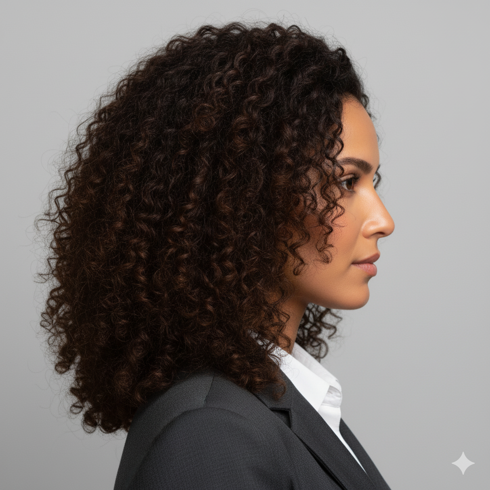

# Personas: The v0.6 Controlled Test Dataset

## The Persona Dataset: Our Scientific Baseline

Early fuzzer versions (v0.1-v0.5) relied on randomized, synthetic images (like those from "This Person Does Not Exist"). While useful for broad discovery, this approach lacked scientific rigor. It was impossible to know if an anomaly was a true pattern vulnerability or just a flaw in that specific synthetic image.

As of v0.6, the fuzzer moves to a fixed, high-quality, and diverse dataset of 6 personas. This change is the most critical step in moving from a simple generator to a scientific research tool.

### Why a Fixed Dataset?

* **Consistency:** We can test thousands of patterns against the *exact same* faces, providing a stable baseline for comparison.
* **Reproducibility:** A successful anomaly against 'Gary' can be scientifically reproduced and validated by other researchers.
* **Diversity:** The dataset includes varied descents, genders, and ages, allowing us to test for biases in how models fail.
* **Controlled Scenarios:** Each persona has consistent, research-grade input images (e.g., frontal, profile) to test patterns under different, repeatable conditions.

To ground our research, we've given each persona a backstory—a "why" they might be interested in privacy-preserving technology. This helps us contextualize our mission.

---

## Meet the Personas

### Gary
* **Role:** Small Business Owner
* **Demographics:** Male, 40s, Northern European descent

> Gary is a small business owner from Milwaukee who runs a network of convenience stores. A few months ago, a case of mistaken identity from a store’s security system flagged him as a shoplifter in a neighboring city. It took him weeks to clear his name.
> Now he’s volunteering in a community tech group that’s advocating for more transparency in commercial AI systems, especially those used in retail surveillance. He isn’t anti-technology — he just doesn’t want a camera deciding his reputation.

### Barry
* **Role:** College Athlete & CS Major
* **Demographics:** Male, Early 20s, West African heritage

> Barry is a college athlete and computer science major from Houston who’s fascinated by machine learning. He recently learned that some facial recognition models misidentify darker skin tones at much higher rates.
> After seeing a friend wrongly stopped by campus security, Barry began contributing to an open-source project analyzing bias in vision systems. His interest isn’t rebellion — it’s about fairness in algorithms and making sure tech recognizes everyone equally.

### Larry
* **Role:** Software Engineer
* **Demographics:** Male, Early 30s, East Asian descent

> Larry is a software engineer working for a major cloud provider in Seattle. His company recently implemented face-based login for internal systems, and he’s uneasy about how much biometric data is being stored.
> He started a quiet internal campaign to push for anonymization and local-only processing, arguing that convenience shouldn’t come at the cost of permanent biometric records. His concern is professional — and deeply personal — since he writes the code that others rely on.

### Carrie
* **Role:** Photographer & Influencer
* **Demographics:** Female, Mid-20s, Eastern European descent

> Carrie is a photographer and social media influencer who lives in Denver. Her images are often scraped by AI companies for model training, and one day she stumbled upon a facial recognition dataset that included dozens of her selfies.
> Now she speaks publicly about consent and digital likeness rights, explaining how easy it is for anyone’s face to become “training data.” Her interest isn’t paranoia — it’s protecting her own image from being used to teach systems she never agreed to train.

### Mary
* **Role:** Civil Servant & Volunteer
* **Demographics:** Female, Early 30s, South Asian descent

> Mary is a civil servant working in urban development who also volunteers in humanitarian protests about housing policy.
> After attending a rally, she learned that facial recognition was used to catalog demonstrators, including herself — even though the event was peaceful and legal. Since then, she’s taken an interest in researching privacy-preserving computer vision, determined to prove that security and civil rights can coexist.

### Sherry
* **Role:** High School Teacher
* **Demographics:** Female, Early 40s, Latina/Hispanic descent

> Sherry is a high school teacher and mother of two in Phoenix. Her school district recently deployed “smart cameras” in hallways to monitor attendance and safety.
> When she noticed the system confusing students who changed hairstyles or wore cultural attire, she realized how flawed and invasive these systems can be. Sherry now helps organize parent-led forums on responsible AI use in education, aiming to balance safety with dignity.

---

## Persona Image Gallery

| Persona | Headshot (Frontal) | Profile (3/4) |
| :--- | :---: | :---: |
| **Gary** |  |  |
| **Barry** |  |  |
| **Larry** |  |  |
| **Carrie** |  |  |
| **Mary** |  |  |
| **Sherry** |  |  |