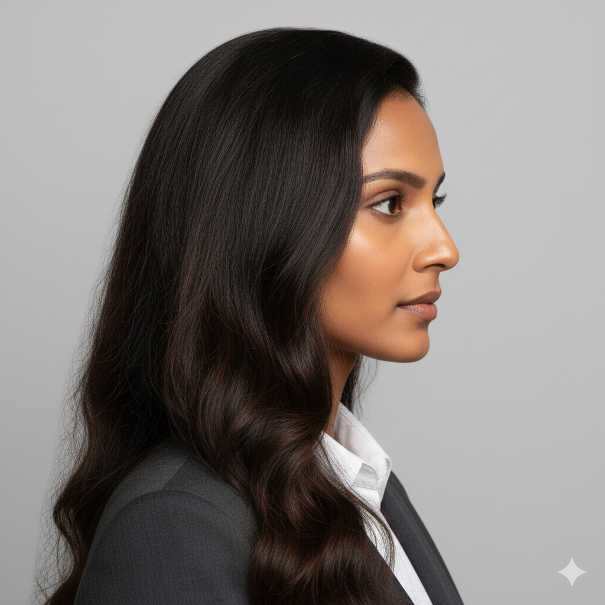

# Personas: The v0.6 Controlled Test Dataset

## The Persona Dataset: The Scientific Baseline

Early fuzzer versions (v0.1-v0.5) relied on randomized, synthetic images. While useful for broad discovery, this approach lacked scientific rigor. It was impossible to know if an anomaly was a true pattern vulnerability or just a flaw in that specific synthetic image.

v0.6 introduced a fixed, high-quality, and diverse dataset of 6 personas. This change is the most critical step in moving from a simple generator to a scientific research tool.

### Why a Fixed Dataset?

* **Consistency:** Test thousands of patterns against the *exact same* faces, providing a stable baseline for comparison.
* **Reproducibility:** A successful anomaly against *'Gary'* can be scientifically reproduced and validated by other researchers.
* **Diversity:** The dataset includes varied descents, genders, and ages, allowing us to test for biases in how models fail.
* **Controlled Scenarios:** Each persona has consistent, research-grade input images (e.g., frontal, profile) to test patterns under different, repeatable conditions.

To ground the research, persona has been given a backstory: a "why" they might be interested in privacy-preserving technology. This helps us contextualize the mission.

---
## **Data Policy and Consent**
All images used for training, baselining, and active fuzzing do not depict real people. All testing relies exclusively on synthetic images generated by AI, including Google Nano Banana and [This Person Does Not Exist](https://thispersondoesnotexist.com/). At this time, no scraped, downloaded, or otherwise obtained `real human` images are being used. Any likeness to a real human is purely coincidental. Should the project move to testing with real human images in the future, full, explicit permission and consent from the individual featured will be secured. If you believe any of the testing images use your likeness and wish for them to be removed, please contact **bill@seckc.org**.

---

## Meet the Personas

### Gary
* **Role:** Small Business Owner
* **Demographics:** Male, 40s, Northern European descent

| Persona | Headshot (Frontal) | Profile (3/4) |
| :--- | :---: | :---: |
| **Gary** |  |  |

> Gary owns a few convenience stores in Kansas City. After a facial-recognition system at a nearby competitor chain falsely matched him to a theft, he spent weeks clearing his name.
> That experience shook his trust in “smart security.”
> Now he’s hunting for ways to avoid being mistaken for someone else again.
> AI-resistant clothing isn’t fashion to him—it’s insurance against another algorithm deciding who he is.

### Barry
* **Role:** College Athlete & CS Major
* **Demographics:** Male, Early 20s, West African heritage

| Persona | Headshot (Frontal) | Profile (3/4) |
| :--- | :---: | :---: |
| **Barry** |  |  |

> Barry studies computer science during the week and trains in track and field on weekends.
> Every summer he heads to DEF CON, where he blends his love of hacking and machine learning.
> After learning that Las Vegas casinos quietly scan every face that walks through their doors, he decided to fight back his own way.
> Barry now looks for AI-resistant clothing that lets him move through the world without being logged, tracked, or tagged by any system.

### Larry
* **Role:** Software Engineer
* **Demographics:** Male, Early 30s, East Asian descent

| Persona | Headshot (Frontal) | Profile (3/4) |
| :--- | :---: | :---: |
| **Larry** |  |  |

> Larry writes code for a major cloud provider, but outside of work he is a prepper.
> His home is stocked with supplies, backup power, and radio equipment.
> He is not worried about losing Wi-Fi.
> He is preparing for the collapse of modern systems.
> When he learned about fabrics that can defeat facial recognition, he added them to his list of essentials.
> In a future where everything is watched, invisibility is survival.

### Carrie
* **Role:** Photographer & Influencer
* **Demographics:** Female, Mid-20s, Eastern European descent

| Persona | Headshot (Frontal) | Profile (3/4) |
| :--- | :---: | :---: |
| **Carrie** |  |  |

> Carrie built an online following with her photography and self-portraits.
> Then she found her face inside a commercial AI dataset.
> Someone had used her likeness to train a system she never agreed to support.
> Now she wants to stay visible to people but invisible to machines.
> Adversarial clothing gives her that balance. It is her way of taking her image back.

### Mary
* **Role:** Urban Planner & Human Rights Volunteer
* **Demographics:** Female, Early 30s, South Asian descent

| Persona | Headshot (Frontal) | Profile (3/4) |
| :--- | :---: | :---: |
| **Mary** |  |  |

> Mary lives under a dictatorship that monitors every street and building.
> After she was flagged in a government database for attending a peaceful protest, she became deeply concerned for her safety and the safety of her family.
> Cameras are everywhere, and she never knows who is watching.
> She follows the work of the World Liberty Congress and looks for AI-resistant clothing that can keep her unseen in public.
> For Mary, privacy is not fashion.
> It is survival.

### Sherry
* **Role:** High School Teacher
* **Demographics:** Female, Early 40s, Latina/Hispanic descent

| Persona | Headshot (Frontal) | Profile (3/4) |
| :--- | :---: | :---: |
| **Sherry** |  |  |

> When her Phoenix school installed AI cameras to monitor attendance, Sherry watched students get flagged for simply changing hairstyles.
> She realized how easy it is for technology to fail the people it claims to protect.
> Now she promotes AI-resistant fashion to her community as a way to preserve personal freedom in public spaces.
> She believes awareness is the first step toward privacy.

---

## The "Campaign" Test Set

To scientifically measure the fuzzer's effectiveness, a controlled dataset built from our 6 Personas is used. This provides a consistent, reproducible baseline for every test.

## Core Image Standards

All "campaign" images are high-resolution, photorealistic, full-body photos. Subjects are in a neutral, forward-facing pose with perfect studio lighting against a solid, neutral gray background.

## The "Magic Color" Mask

All target "wearable" items (scarves, shirts, etc.) are rendered in a solid, untextured, vibrant matte green: #00FF00. This "green-screen" color acts as a perfect, reliable mask, telling the fuzzer exactly where to apply its patterns.

## Test Campaigns

Each persona is tested across three distinct campaigns to understand how a pattern's location affects detection and recognition models.

### Campaign 1: Non-Occluding (HCB-Attack)

    Goal: Test patterns that are adjacent to the face but do not cover it.
    Wearables: Scarf (low), Shawl, Neck Gaiter (low).

### Campaign 2: Disjoint Mask (Person-Detection)

    Goal: Test patterns that are completely separate from the face, isolating the effect on person-detection.
    Wearables: T-Shirt (all personas), Dress (females only).

### Campaign 3: Occluding (Degraded-Condition)

    Goal: Test patterns that intentionally obscure key facial features.
    Wearables: Bandana (outlaw-style), Headband (over-brows), Neck Gaiter (high), Hoodie (up), Balaclava.

---
Google Gemini (Nano Banana) was to generate the test images using this prompt:

    I will be providing you a series of persona types. Each persona will have a name and some characteristics of that persona. 
    I want you to generate a series of high-quality, photorealistic images for a computer vision research project.

    Core Image Requirements (Mandatory):
    Style: High-resolution, photorealistic "full body" photo. This should include the entire full body 
           including legs and feet (the subject should be wearing shoes)
    Pose: Subject is facing straight-on at eye-level.
    Expression: Neutral expression (mouth closed, looking directly at the camera).
    Lighting: "Perfect studio lighting" (soft, even, no harsh shadows on the face or background).
    Background: Solid, neutral light gray (#CCCCCC).
    Resolution: 1024x1536
    Shoes: Neutral shoes unless specified
    Females I want t-shirt and dress, for males only t-shirt. 
    Each image should be of that person only, and seach Campaign image should be an individual file named appropriately 
    Campaign, Persona, and Wearable (e.g., "CP1-Gary-Scarf," "CP3-Barry-Hoodie," etc.).
    
    
    "Magic Color": All specified wearable items must be a solid, untextured, vibrant matte green-screen color: HEX 
    #00FF00. This color must have no shadows, reflections, or textures. For each persona I give you, I will provide
    certain types of accessories I want the person to be wearing as well as campaign. I want you to generate one image
    of the same persona for each of the following "Campaigns."
    
    Campaign 1: HCB-Attack (Non-Occluding)
    Goal: The subject's face is 100% visible (exception: "Mary's" sunglasses). The #00FF00 green item is adjacent to
    the face but does not cover the chin, mouth, or nose.
    
    1. Scarf: A #00FF00 green scarf wrapped low around the neck, clearly visible below the chin.
    2. Shawl: A #00FF00 green shawl draped over both shoulders. The fabric is visible next to the cheeks and neck but
    does not occlude them. This should include the entire full body including legs and feet (the subject should be
    wearing shoes)
    3. Neck Gaiter (low): A #00FF00 green neck gaiter worn down around the neck, bunched up like a thick collar, 100%
    below the chin. This should include the entire full body including legs and feet (the subject should be wearing shoes)
    
    
    Campaign 2: Person-Detection (Disjoint Mask)
    Goal: The subject's face is 100% visible (exception: "Mary's" sunglasses). The #00FF00 green item is on the torso,
    completely separate from the face.
    5. T-Shirt: A solid #00FF00 green crew-neck t-shirt. This should include the entire full body including legs and feet
    (the subject should be wearing shoes)
    6. Dress: A solid #00FF00 green dress. (Generate for females only: Carrie, Mary, Sherry).
    
    Campaign 3: Degraded-Condition (Occluding)
    Goal: The #00FF00 green item intentionally covers parts of the face, creating an occluded image.
    
    7. Bandana (Face): A #00FF00 green bandana worn "outlaw style," tied at the back of the head. It is pulled up to
    cover the nose, mouth, and jaw, stopping just below the eyes. The shirt should be a black t-shirt. This should include
    the entire full body including legs and feet (the subject should be wearing shoes)
    8. Headband: A #00FF00 green bandana folded and worn as a "fandana" or headband, tied around the forehead the knot is
    not visible. It must cover the hairline and occlude the eyebrows, but the eyes should be visible.
    9. Neck Gaiter (high): A #00FF00 green neck gaiter worn as a face mask, pulled up to cover the mouth and nose, stopping
    just below the eyes.
    10. Hoodie: A #00FF00 green hoodie with the hood pulled up. The hood should be deep, casting a light shadow over the
    forehead (but not the eyes) and completely covering the ears, hairline, and sides of the face.
    11. Cowl / Balaclava (high): A #00FF00 green cowl worn as a balaclava, exposing only the eyes.
    
    Final Output: Please provide the full set of images, clearly labeled by Campaign, Persona, and Wearable 
    (e.g., "CP1-Gary-Scarf," "CP3-Barry-Hoodie," etc.). 
    Please generate ALL the images (1-11) as they have been described, name them correctly, and provide them 
    to me in a zip file for downloading.
    
    
    Please ask me any clarifying questions (if you have any) or let me know if you are ready for the first persona 
